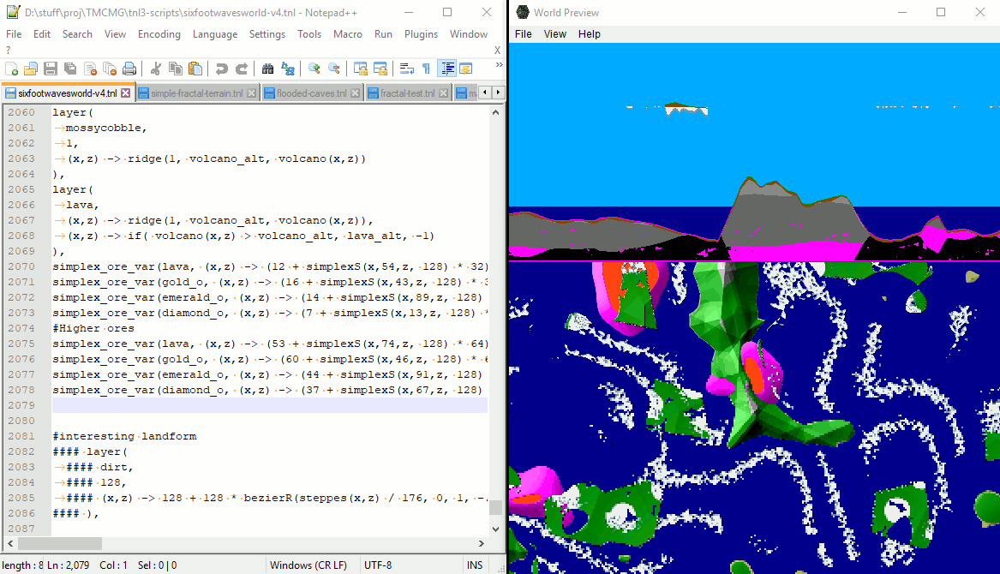

# TOGoS's Minecraft Map Generator

TOGoS's Minecraft Map Generator (TMCMG) is a Java application for
generating terrain data for Minecraft based on stateless user-defined
height and material functions.  It includes a GUI for previewing
the generated terrain before exporting it, and can also be run from
the command-line.




## GUI Notes
### World Preview

This window shows side and top views of the terrain resulting from
interpreting the loaded script.  You can move around using the arrow
keys and zoom in and out using plus and minus.  For now this shows
only base terrain--no chunk-based objects such as trees or grass will
appear in the preview.  The number next to "MPP" near tht bottom
indicates Meters Per Pixel.


### Export Chunks

This window pops up when you select Export Chunks under the File menu.
To select an output directory (this should be a directory directly
under 'saves/' for SP data), you must browse to that directory and
select a file directly within that directory, such as 'level.dat'.

The 4 boxes under the output directory selection are to give the
X and Z coordinates of the northeastern-most corner and the width and
height of the area to generate.  X, Z, width, and depth are all in terms
of chunks, which are 16 blocks (16 meters) on a side.

When you hit 'Generate' it will start generating new data for
those chunks and writing them into the chosen output directory.
WARNING: THIS WILL OVERWRITE ANY EXISTING TERRAIN/BUILDINGS/OBJECTS
IN THE AREA, so either back up your data before generating, or only generate
on maps that have nothing you want to keep.


## TOGoS Noise Language

TOGoS Noise Language (TNL) is the language for defining terrain
generation functions.  TNL files contain any number of named expression
definitions and one non-named expression that will be used when generating
terrain.  Expressions can refer to named expressions defined earlier using
their name.  The tnl3-scripts/ directory contains some example scripts.

TNL has been updated from v1 to v3, and there are significant (but
manageable) differences between them.  Older scripts will need to
be updated in order to work with new versions of TMCMG.
See TNL3-CHANGES for details.


### General syntax

    word1 = definition1;
    word2 = definition2;
    expression

e.g.  the following program evaluates to '100'

    radsauce = 42;
    gallsauce = 58;
    radsauce + gallsauce

You can define named functions like so:

    big-simplex(x,y,z) = simplex(x / 100, y / 100, z / 100) * 100; 
  
Or inline using the '->' operator, like so:

    (x,y,z) -> simplex(x / 100, y / 100, z / 100) * 100


### Pre-defined infix operators

(these are all regular functions in disguise) 

_parameters_ -> _value_
  - define a function. e.g.
    
        x -> sin(x) + cos(x)
    
    or
    
        (x,y,z) -> (x * x + y * y + z * z) ** 0.5

```+```, ```-```, ```*```, ```/```, ```**```

  - add, subtract, multiply, divide, and power.
    These can be written using infix notation, where
    standard precedence rules apply.  e.g.  the following 3
    expressions are equivalent:
    
        a - b + c * d / e
        a - (b + ((c * d) / e))
        -( a, +(b, /( *(c, d), e)))

```==```, ```!=```, ```>```, ```<```, ```>=```, ```<=```

  - Compare value of 2 expressions.
    
        == equal            ;  3 == 3
        != not equal        ;  1 != 2
        >  greater          ;  5 >  4
        <  less             ; -3 < -2
        >= greater or equal ;  1 >= 1
        <= less or equal    ;  1 <= 3


### Pre-defined functions

  - sin( _expr_ ) - sine
  - asin( _expr_ ) - inverse sine
  - cos( _expr_ ) - cosine
  - acos( _expr_ ) - inverse cosine
  - tan( _expr_ ) - tangent
  - atan( _expr_ ) - arctangent
  - sqrt( _expr_ ) - square root (mathematically equivalent to _expr_ ** 0.5)

perlin( _x_, _y_, _z_ )
  - A function for generating smooth noise closely based on Ken Perlin's
    Improved 3D noise function.  The range of this function is -1 to +1
    and output is 0 at integer coordinates, so for example to create
    rolling hills using a single perlin noise function you should multiply
    the output by half the desired height between hilltops and valley floor
    and divide the inputs by the desired average distance between hills
  - e.g. 8 * perlin( x / 20, y / 20, z / 20 )
    would result in hills about 20 meters apart and 16 meters from top to
    base.
  - See http://en.wikipedia.org/wiki/Perlin_noise

simplex( _x_, _y_, _z_ )
  - A bit like perlin noise, but based on a triangular grid, so in
    theory is somewhat faster and has less noticable directional artifacts.
  - The implementation used by TMCMG seems to have lower average amplitude
    than perlin noise, so you may want to multiply the output more to get
    a similar effect.
  - See http://en.wikipedia.org/wiki/Simplex_noise

if( _cond1_, _res1_, _cond2_, _res2_, ..., _default_ )
  - Where the result of _cond1_ is true, result is determined _res1_, etc.
  - If no listed conditions are true, result is determined by _default_

### World Definition Functions

To define a Minecraft world generator, your program needs to define
a layered-terrain object that provides material types and floor and
ceiling-heights for a number of 'layers'. 

layered-terrain( _layer1_, _layer2_, ... )
  - defines a world generator that generates terrain based on a list
    of ground material layers and chunk processors.
  - when layers of material overlap, later layers' materials override
    those of earlier layers.  For instance if the first layer at a given
    point on the map is water (material) from 0 (floor) to 64 (ceiling),
    and the second layer is bedrock from 0 to 1, the bedrock will
    replace the water in the bottommost block at that point.

layer( _material-id_, _floor-height-function_, _ceiling-height-function_ )
  - define a material layer for use with layered-terrain
  - material-id is a constant integer or a 3-argument function
    representing the material to be placed at each point in space
    between the layer's floor and ceiling.
  - floor-height and ceiling-height must be constant numbers or
    2-argument functions giving the layer's floor and ceiling heights
    for a given x, z coordinate in the world.

### World Definition Post-processors

Include these within your layered-terrain(...) after layer definitions.

grassify
  - add grass to dirt blocks that are directly under the sky

flag-populated
  - mark chunks as populated so that Minecraft doesn't add its own trees,
    ores, etc.


## Contact

If it doesn't work, e-mail bug reports and complaints to

    togos zero zero at gee male daught com.

You may also use the ticketing system on GitHub to request
features or add them yourself: http://github.com/TOGoS/TMCMG/
